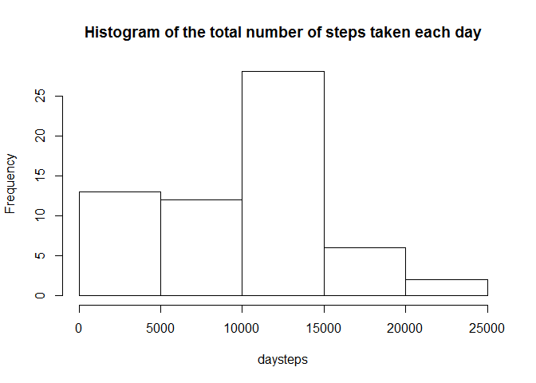
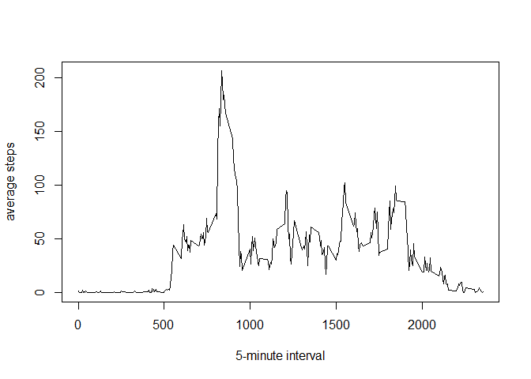
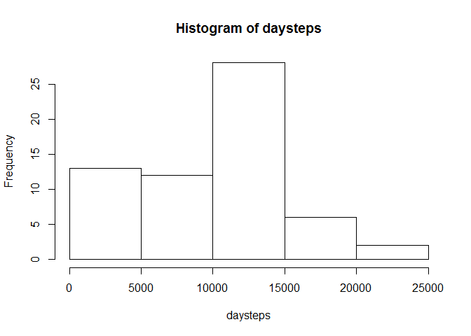
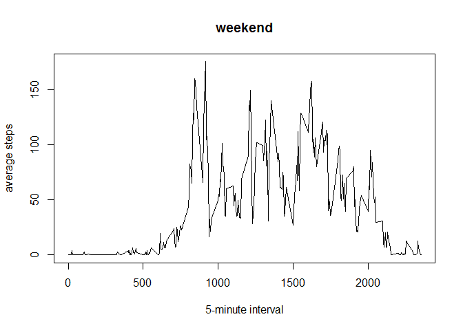
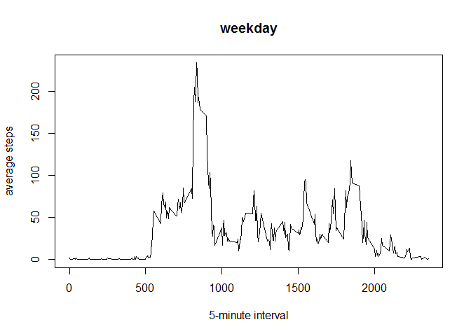

# Reproducible Research: Peer Assessment 1


## Loading and preprocessing the data

```r
data<-read.csv("activity.csv")
data$date<-as.Date(data$date)
datedata<-split(data,data$date)
intdata<-split(data,data$interval)
```


## What is mean total number of steps taken per day?

```r
daysteps<-sapply(datedata,function(x) sum(x[[1]],na.rm=TRUE))
hist(daysteps,main="Histogram of the total number of steps taken each day")
```

 

```r
mean(daysteps)
```

```
## [1] 9354.23
```

```r
median(daysteps)
```

```
## [1] 10395
```


## What is the average daily activity pattern?

```r
avgintsteps<-sapply(intdata,function(x) mean(x[[1]],na.rm=TRUE))
plot(names(avgintsteps),avgintsteps,type="l",xlab="5-minute interval",ylab="average steps")
```

 

```r
names(which.max(avgintsteps))
```

```
## [1] "835"
```


## Imputing missing values

```r
sum(is.na(data$steps))
```

```
## [1] 2304
```
filling the missing values with the means for those 5-minute intervals

```r
mfdata<-data
for(i in 1:nrow(data)){
        if(is.na(data[i,1])){
                mfdata[i,1]<-avgintsteps[as.character(data[i,3])]
        }
}
mfdaysteps<-sapply(split(mfdata,mfdata$date),function(x) sum(x[[1]]))
hist(daysteps)
```

 

```r
mean(mfdaysteps)
```

```
## [1] 10766.19
```

```r
median(mfdaysteps)
```

```
## [1] 10766.19
```
These values slightly differ from the estimates from the first part of the assignment but the estimates of the total daily number of steps a lot differ.


## Are there differences in activity patterns between weekdays and weekends?

```r
wd<-factor(rep("weekday",nrow(data)),levels=c("weekday","weekend"))
for(i in 1:nrow(data)){
        if(weekdays(data[i,2])=="Saturday"|weekdays(data[i,2])=="Sunday"){
                wd[i]<-"weekend"
        }
}
wddata<-split(data,wd)
wdintdata<-split(wddata$weekday,wddata$weekday$interval)
weintdata<-split(wddata$weekend,wddata$weekend$interval)
wdavgintsteps<-sapply(wdintdata,function(x) mean(x[[1]],na.rm=TRUE))
weavgintsteps<-sapply(weintdata,function(x) mean(x[[1]],na.rm=TRUE))
plot(names(weavgintsteps),weavgintsteps,type="l",xlab="5-minute interval",ylab="average steps",main="weekend")
```

 

```r
plot(names(wdavgintsteps),wdavgintsteps,type="l",xlab="5-minute interval",ylab="average steps",main="weekday")
```

 
